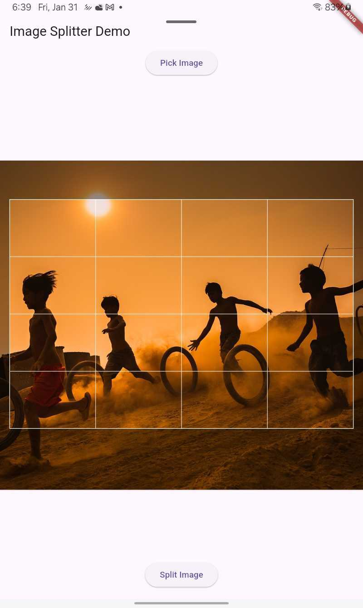

# Image Splitter

A Flutter package that allows you to split images into customizable grids with an interactive preview. This package provides an easy way to select a portion of an image and split it into equal parts.

## Screenshot



## Features

- 🖼️ Split images into customizable grids
- 📱 Interactive preview with pan and zoom
- 🎯 Precise area selection
- 📐 Adjustable grid dimensions
- 🔄 High-quality image processing
- 💫 Smooth animations and UI
- 📦 Easy to use API

## Installation

Add this to your package's `pubspec.yaml` file:

```yaml
dependencies:
  image_splitter: ^0.0.3
```

## Usage

### Basic Implementation

```dart
import 'package:image_splitter/image_splitter.dart';

// In your widget
ImageSplitter(
  image: File('path/to/image.jpg'),
  crossAxisCount: 3,
  rowCount: 3,
  onControllerReady: (controller) {
    // Store controller for splitting operation
    splitterController = controller;
  },
)
```

### Complete Example

```dart
class ImageSplitterDemo extends StatefulWidget {
  @override
  State<ImageSplitterDemo> createState() => _ImageSplitterDemoState();
}

class _ImageSplitterDemoState extends State<ImageSplitterDemo> {
  File? imageFile;
  ImageSplitterController? splitterController;

  Future<void> pickImage() async {
    final picker = ImagePicker();
    final pickedFile = await picker.pickImage(source: ImageSource.gallery);
    
    if (pickedFile != null) {
      setState(() {
        imageFile = File(pickedFile.path);
      });
    }
  }

  Future<void> splitImage() async {
    if (splitterController != null && imageFile != null) {
      try {
        final splitImages = await splitterController!.splitImage(imageFile!);
        // Use the split images as needed
        print('Successfully split into ${splitImages.length} images');
      } catch (e) {
        print('Error splitting image: $e');
      }
    }
  }

  @override
  Widget build(BuildContext context) {
    return Scaffold(
      body: Column(
        children: [
          if (imageFile == null)
            ElevatedButton(
              onPressed: pickImage,
              child: Text('Pick Image'),
            )
          else
            Expanded(
              child: ImageSplitter(
                image: imageFile!,
                crossAxisCount: 3,
                rowCount: 3,
                onControllerReady: (controller) {
                  splitterController = controller;
                },
              ),
            ),
          if (imageFile != null)
            ElevatedButton(
              onPressed: splitImage,
              child: Text('Split Image'),
            ),
        ],
      ),
    );
  }
}
```

## API Reference

### ImageSplitter Widget

| Parameter | Type | Description |
|-----------|------|-------------|
| image | File | The image file to be split |
| crossAxisCount | int | Number of columns in the grid |
| rowCount | int | Number of rows in the grid |
| cellHeight | double | Height of each grid cell (default: 100) |
| cellWidth | double | Width of each grid cell (default: 100) |
| onControllerReady | Function(ImageSplitterController)? | Callback when the controller is ready |
| loaderColor | Color | Color of the loading indicator (default: Colors.blue) |

### ImageSplitterController

The controller provides methods to perform the splitting operation:

```dart
// Split the image based on current selection
Future<List<Uint8List>> splitImage(File image)
```

## Additional Information

### Requirements

- Minimum Flutter SDK version: 3.0.0
- iOS: Add photo library usage description to Info.plist
- Android: Add READ_EXTERNAL_STORAGE permission to AndroidManifest.xml

### Image Processing

- The package automatically handles large images by scaling them down while maintaining quality
- Split images are returned as JPEG format with 85% quality
- Processing is done in an isolate to prevent UI freezing

## Contributing

We welcome contributions! Please feel free to submit issues and pull requests.

## License

```
MIT License

Copyright (c) 2025 Usama Ahmad

Permission is hereby granted, free of charge, to any person obtaining a copy
of this software and associated documentation files (the "Software"), to deal
in the Software without restriction, including without limitation the rights
to use, copy, modify, merge, publish, distribute, sublicense, and/or sell
copies of the Software, and to permit persons to whom the Software is
furnished to do so, subject to the following conditions:

The above copyright notice and this permission notice shall be included in all
copies or substantial portions of the Software.

THE SOFTWARE IS PROVIDED "AS IS", WITHOUT WARRANTY OF ANY KIND, EXPRESS OR
IMPLIED, INCLUDING BUT NOT LIMITED TO THE WARRANTIES OF MERCHANTABILITY,
FITNESS FOR A PARTICULAR PURPOSE AND NONINFRINGEMENT. IN NO EVENT SHALL THE
AUTHORS OR COPYRIGHT HOLDERS BE LIABLE FOR ANY CLAIM, DAMAGES OR OTHER
LIABILITY, WHETHER IN AN ACTION OF CONTRACT, TORT OR OTHERWISE, ARISING FROM,
OUT OF OR IN CONNECTION WITH THE SOFTWARE OR THE USE OR OTHER DEALINGS IN THE
SOFTWARE.
```
